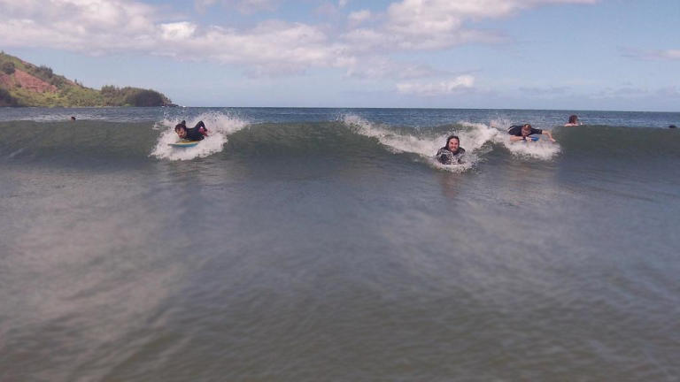
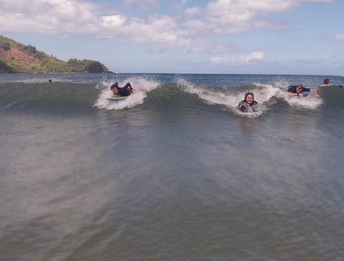
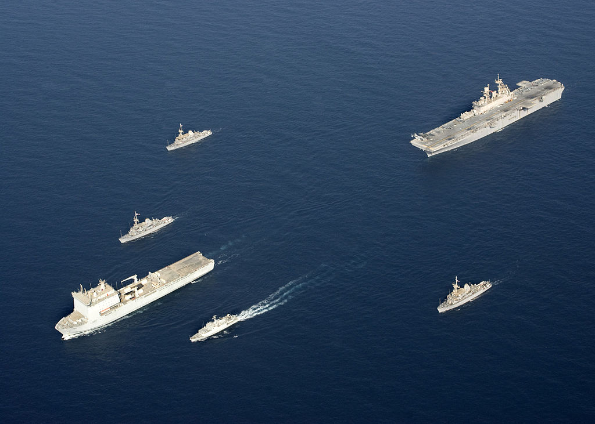

# Seam-Carver

Seam-Carver is a content-aware image resizing application helping to change the image's aspect ratio. It resize images by removing the lowest-energy vertical and horizontal "seams." This technique, [*seam carving*](https://en.wikipedia.org/wiki/Seam_carving), is proposed by Shai Avidan and Ariel Shamir at [*
Seam carving for content-aware image resizing*](https://dl.acm.org/citation.cfm?id=1276390) in 2007.

A dynamic demonstration of seam carving is also available [on YouTube](https://www.youtube.com/watch?v=6NcIJXTlugc).

This Java project is implemented as an application of seam carving. More functionalities are under construction. This repository is forked from [mgruben/seam-carving](https://github.com/mgruben/seam-carving).


## Usage

### Prerequisites
1. Install [Java](https://www.java.com/en/download/help/download_options.xml) on your computer.
2. Clone or download this repository to your local directory.
3. Enter `javac SeamCarver.java` in your terminal to compile. You should see files `SeamCarver.class` and `Picture.class` in the same directory after comiling.

## Reduce image height or width
```
java SeamCarver <imagefile> <h|w> <numberOfSeamsToRemove>
```
For example, enter `java SeamCarver example.jpg h 200` if you wanted to reduce the width of picture `example.jpg` by 200 pixels.

## Increase image height or width [ 🚧 Under construction 👷🔧️🚧 ]

Better interaction solutions are under construction.


## Sample Resizings

Original:  
   
[Source](https://www.instagram.com/p/9CjZeFIinS/?taken-by=mmxxvii)  

Resized:  


Resized:  
   

Original:  
   
[Source](http://coursera.cs.princeton.edu/algs4/assignments/seamCarving.html)  

Resized:  


Original:  
   
[Source](https://commons.wikimedia.org/wiki/File%3AUS_Navy_090905-N-3165S-631_The_Royal_Navy_fleet_auxiliary_ship_Lyme_Bay_(L_3007)_leads_a_formation_of_ships.jpg)

Resized:  
   

Original:  
   
[Source](https://commons.wikimedia.org/wiki/File%3AMonument_Valley_Panorama_2.jpg)


## License
```
Copyright (C) 2017 Michael <GrubenM@GMail.com>

This program is free software: you can redistribute it and/or modify
it under the terms of the GNU General Public License as published by
the Free Software Foundation, either version 3 of the License, or
(at your option) any later version.

This program is distributed in the hope that it will be useful,
but WITHOUT ANY WARRANTY; without even the implied warranty of
MERCHANTABILITY or FITNESS FOR A PARTICULAR PURPOSE.  See the
GNU General Public License for more details.

You should have received a copy of the GNU General Public License
along with this program.  If not, see <http://www.gnu.org/licenses/>.\n
```
